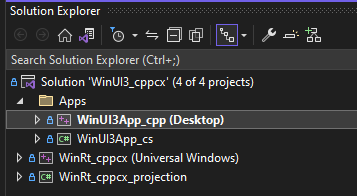

# WinUI 3 with C++/CX

This sample demonstrates how older C++/CX Windows Runtime components can still be consumed from modern WinUI 3 applications written in either C++/WinRT or C#. It combines a native component, a generated CsWinRT projection, and two app front ends so you can compare interop patterns across languages and projection layers.

## Solution Structure

```text
WinUI3_cppcx
|-- WinRt_cppcx/             C++/CX Windows Runtime component
|-- WinUI3App_cpp/           C++/WinRT consumer app
|-- WinUI3App_cs/            C# WinUI 3 consumer app
`-- WinRt_cppcx_projection/  CsWinRT projection for C# consumption
```

## Key Details

- `WinRt_cppcx` contains the component authored with C++/CX.
- `WinUI3App_cpp` shows how a C++/WinRT WinUI 3 app can consume that component.
- `WinUI3App_cs` shows the C# side of the same story through the generated projection layer.
- `WinRt_cppcx_projection` provides the CsWinRT projection that makes the C++/CX component easy to reference from managed code.
- The solution is a practical reference when migrating code incrementally instead of rewriting every WinRT component at once.
- The C# app also demonstrates AppWindow-based windowing APIs alongside the interop sample.
- Because both consumers are in the same solution, it is easy to compare native and managed usage patterns side-by-side.

## Building

1. Open `WinUI3_cppcx.sln` in Visual Studio 2022.
2. Restore dependencies and ensure C++ desktop, .NET desktop, and Windows App SDK workloads are installed.
3. Build the solution for a supported target such as `x64` or `ARM64`.
4. Ensure the component and projection build before launching the consumer apps.
5. Run either `WinUI3App_cpp` or `WinUI3App_cs` to inspect how each app consumes the shared runtime component.

